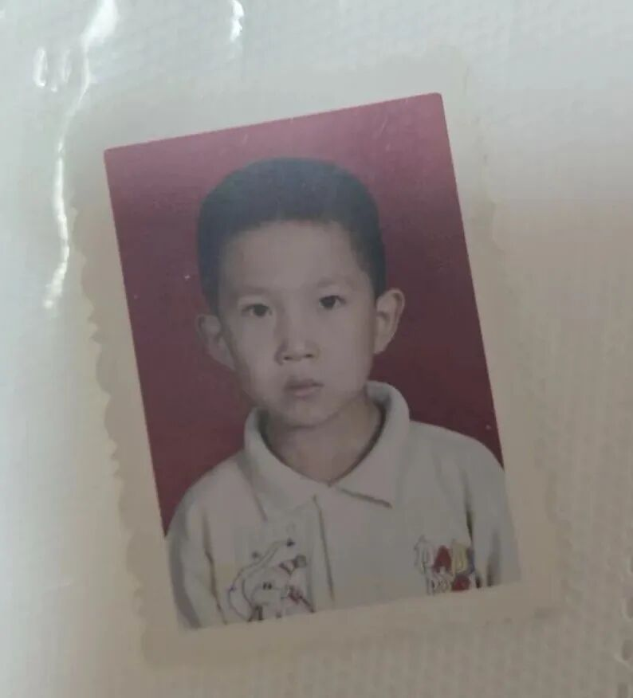

# 我在河津上小学

> 作者: 凡复思忖 | 日期: 2026-03-19

**我小学时由于搬家，共上过两个学校。那时候还只需要上五年，从2001年到2006年，分别上的是一小的1(2)班，2(6)班，3(2)班，搬家之后，是四小的4(3)班，5(3)班。**

**小时候照片镇楼。**

**距今已经25年了，我眉头一动，妈妈带我去上一小的那个早上，会再次浮现在脑海。**

从河津博物馆出发，一路经过一个幼儿园，我看幼儿园墙面上画的五颜六色的，就问妈妈这是不是小学？妈妈说不是，一小在前面。将我送进学校后，她继续往前，就到了她自己的工作单位了。河津那时候市区内的1路车和3路车是相反方向的，我们俩上学和上班都可以坐1路车。

小孩子刚进学校，看到这么多人，免不了要走错班级。**老师给我排好座位后，我出去上厕所，回来就走到了1(1)班同一个座位上。还没坐下，就发现周围的人和刚才完全不一样。**我先慌了神，才反应过来自己走错了，赶快灰溜溜地退出去。

一小的操场有一个巨大的攀爬架，很高，无任何保护措施。这么多年来，不知道有没有孩子从上面摔下来。我从小就不敢爬上去。但是当时的同学柴帅，爬上爬下如履平地。那是一个斜着的梯子，上到最高处后，是一个平着的梯子，另一边对称的地方也是同样的梯子，全是镂空道路。不知道当时怎么回事，就敢让孩子们在那里玩。

一年级考试的时候，为了降低学生密度，我们都被安排在大操场上进行。每个小小的我们，抱着凳子，往操场上一坐，顶着太阳就开始写卷子。那个时候的卷子在现在看来完全就是常识，基础中的基础，很惊讶，我们竟然能真的从猴子进化成现在的文化人。

**小当家方便面里面会赠送一张卡，主题是孙悟空的七十二变，我们就拿那张卡来进行最早的对战。**玩法是两个人各拿出一个卡，猜拳决定谁下手，用自己的卡把对面的打翻过来，就算赢得了这张卡。这个游戏对于卡的素质有很高的要求。首先是一定要面积大，其次要尽可能平一些，如果还能薄的话就最好了。**包裹猴**的原版是最垃圾的一张，头很大，导致放在地上就支撑起来了，很容易被人打翻。**齐天大圣猴**是最优之选，很小，像个纸片，放地上手都不一定拿得起来。大家拿到卡之后，都会进行DIY，把它在地面上磨平，增加胜率。

我为了赢，看到柴帅的卡磨得很平，就问他窍门，他告诉我说他在家门口磨卡。放学之后，我先不回家，去他家找他，拜托他帮我磨卡。他妈妈开的门，问我的来意，我说想要让他帮我把卡磨一下。他妈妈就以他要写作业为由，拒绝了我。**第二天我跟他说起此事，他说你傻啊，你就不能说是要找我问作业？我一拍脑袋悔之莫及。他带我去看了他的工坊，满片粗糙的砖头地上，有一小块光滑的，波浪形的石面。**他向我演示，把卡放在石头上，拿脚踩着来回磨，磨完后的卡油光锃亮的。怪不得他是常胜将军呢。

到了二年级时，大家对学校逐渐熟悉了起来，小孩子好动的性格渐渐显露。那个时候大家都围在楼梯上玩，我们那层是平的，转角处是上三楼的楼梯，楼梯扶手与梯面是用铁杆相连的。不知谁第一个发起的，他从楼梯半路，探身出来，左手抓住扶手，右手抓住最底层的那根铁杆，一个翻身，身体在半空画出优美的弧线，稳稳地落在地面上。风靡一时。我也很喜欢玩。

**另有一伙跳皮筋的，男女都玩。不过女生跳得比较优美，脚下翻飞，身姿曼妙。而男生就只能玩一玩“小马扎”和“骑马”这种一板一眼的了。**跳皮筋有不同的等级，两个人支着，一级是放在脚脖子处，是个人都能跳。二级是放在膝弯处，失败率就开始飙升了。三级是放在腰间，这时候很多人就已经跳不过去了。开始时我也跳不过去，直到某一天开窍了，会起跳的同时扭腰了，多高的皮筋我都能用脚勾下来了。后来在家里，拿饮料箱摆着自己玩，也很开心，我的老寒腿可能就是这时候养成的习惯。

**大家另有一个喜欢的游戏是叠罗汉，**一个人趴在桌子上，其他的人挨个从讲台上往他身上扑，叠高高，最高的时候叠了5到6个人。有一次我是最后一个，叠上去之后突然感觉到有人拉我，我人没回头，就冲他喊，别拉我。听到同学们都在笑。一回头发现是老师，尴尬。

**那年的非典搞得人心惶惶。我们躲在家里，妈妈从外面拿回来非常苦的中药。我最喜欢喝的一款饮料叫“康有利”，喝起来像是运动饮料的风格，只是那年之后再也没有见到过。**

小学门口有很多的小摊贩，“流口水，口香糖，哪个娃吃了哪个娃tiang”就是在我们门口摆摊。**每次出门时妈妈让我带着公交车的钱，我都会花掉一些买老虎肉啊，流口水啊，吃掉。到了回家的时候，钱就不够了。**后来我们发现了一个规律，车上人很挤，大家上车后才买票，售票员根本不知道每个人交了多少钱，只知道收没收。**票价是3毛钱，有时候只给1毛钱也问题不大。**但是要注意，其中一个男售票员查得很仔细。那天我花的只剩下1毛，等公交车来时，发现售票员是男的，扭头就要走等下一辆时，妈妈在车上喊我，我愉快地上了车，妈妈帮我交了钱。

**那个时候《半条命》非常火。我家里虽然有台电脑，但是爸爸不让玩。我跟卫竣时常去网吧旁观。**爸妈为了制止，也跟我进行猫捉老鼠。我清楚地记得有一天晚上，我看的特别晚，到了8点多钟了，爸妈看到我没回家，猜到我去网吧了。 爸爸就带着叔叔，提着饭，挨个网吧找我。找到我所在的那家时，我为了避免被找到，躲在了桌子底下。晚上也不敢回家，回了老舅家睡觉，第二天早上再走很远去学校上学。有一次情况严重了，妈妈让我在阳台罚站，印象深刻。小时候真没少挨过打。卫竣小时候和我一块，我们俩没少干坏事，他还带我在我家门口趴在铁路轨道边上，等火车过来的时候砸火车。我能活到现在真是万幸啊。

小时候妈妈想让我学一门特长，先送我去了星期六画室。我现在都能记得那个蜡笔的触感。但是我上画画课的时候，也不好好上。很多时候想逃学，但是又没什么合适的理由。那个夏日的午后，我全身无力，实在是不想去，哀求也没有用。**出门我就疯狂地往自行车锁里面灌沙子，告诉妈妈说自行车打不开。妈妈出门三下五除二给我打开，这下没有理由了，只得硬着头皮去。**

那段时间我们住在翠岭区。每次从学校回家时，要从通岭街穿过一个黑黑的巷子走回去。我刚看完《春光灿烂猪八戒》，害怕里面的猫妖。每次穿过那条巷子时，都会害怕有东西从上面扑下来。住在家里时，一个人也不敢睡。**我爸就用心药来医我的心病，提着我那条玩偶大狗，说这是二郎神的哮天犬，猫妖过来的话，它就活了，把猫妖赶跑。**

那段时间跟阮磊强，周栋宾都玩的不错。去家里拜访过。只是后来再也没有联系了。**这要放在现在，小微信一加，小电话一存，怎么可能丢了。**

到了三年级还发生了一件爆笑的事儿，我现在跟别人讲起，自己都要先笑个五分钟。一小的厕所是专门在一小块区域，像是个连廊，大家上完厕所，都会在门外，把脑袋伸到窗外去放个风。**站在最高处的同学，也许是某一天突发奇想，冲着下面的脑袋吐了口唾沫，由此闹得一发不可收拾，被吐过唾沫的人再也不会在低层把头伸出窗外；而吐了别人唾沫的人，越来越觉得不过瘾，开始含一口水直接往下喷。**状况愈演愈烈。发展到后来，不用有高低差，大家直接原地开喷，有个哥们吐唾沫功底很强，手作枪型往嘴前面一摆，吐出来的水又多又直，要是有吐唾沫大赛，派他去参加，肯定能拿个奖杯。后来老师出面制止大家继续这样玩下去，也没有更新的人中招了，大家也都撒手不玩了。

**这是背景。**

**我们玩球时，球从楼道的窗户处掉了下去。上面留了两个同学盯着球，我跟另一个同学下楼去捡。他在楼下找了半天找不到。然后探着脑袋向楼上的同学询问。我当时站在他旁边，眼睁睁看着他抬头张嘴的时候，一口唾沫不偏不倚掉进了他的嘴里。这下球也不捡了，冲上去就要去打那个吐唾沫的同学。那个同学说，实在是没忍住，看到下面出现一个头，就啐了一口。（我写到这里的时候依然笑个不停）**

三年级最后一段时间，爸妈忙，没空管我，就让我寄宿在学校门口的一个托管所里面。睡的上下铺，每天在那个阿姨家里吃饭。阿姨还问我爸妈当时一天能有多少钱，我哪里有概念啊，随口就是一天怕不得有一万吧。把她给吓到了。实际上根本没有。那边跟我同住的还有个肉肉的变态大哥。因为我们男女是住在同一个屋，用帘子隔开。那个大哥时不时就想看看女生那边啥样，然后回来跟我们讲。都是小学生，不知道他看到了些什么。

计生局的房子建成后，我们就搬到了龙门大道。爸妈依然没空管我。我总是一个人在家里，新房子没有闭路电视，我就拿着DVD光盘疯狂地看。**一个人依然不敢睡觉，就躺在客厅沙发上，一部部地看李连杰的电影，直到睡着。夏日的夜晚，我也看柯南，每次门开的时候，我都怕黑衣人冲进来把我掳走。等爸妈回来，把睡着的我抱回房间，循环往复。**

我也转到了四小上学。这边离家就非常近了，走路20分钟就可以到。我不再用人接送。在这边，认识了院里的许多孩子。任晓波，元波，贺浩杰，小胖，小猪，彤彤等等。我们经常去楼下，玩各种各样的游戏：丢沙包，跳马，捉迷藏。

丢沙包的时候，我们的规则是两边各站一人互相传沙包，中间的人躲避，如果抢到了沙包，加一条命。两边的人如果互传成功，则中间的所有人都要定住，脚不能动，等着被砸，这种情况下如果能接到沙包，也加一条命。也许是这时候练的，我的准头异常的好，丢东西很准，像是一位多年的老教师，拿粉笔砸人百发百中。我去年在微软的元宵活动上，玩丢沙包的项目，别人还要瞄准半天，两次机会才能中。我上去轻轻一扔，空心。

跳马就很简单，一个人当马，别人从他身上撑过去。蹲着是一级，手拄着脚踝是二级，拄着膝盖是三级，抱拳在胸口是四级，再抬一些是五级。胖的人天然劣势，根本跳不过去。我们跳的时候也瞎跳，那些太高的，我们上去时，掐着人家的脖子往下压，都给压得不长个儿了。谁没跳过去，下一轮当马。

捉迷藏是我们最推陈出新的一个项目。**传统的捉迷藏**就是一个人趴着数十个数，其他人找地方躲。最后躲避的人要回到原点才算成功。好无趣，好无聊。我们新创的**技能捉迷藏**，不用人回到原点，只要有一件东西能碰到原点就行。好好玩，酷毙了。于是那晚，小猪趴在配电箱上，数数的时候，所有人都拿着块石头，等着他数完，集体砸配电箱。但是小胖拿的石头有点大，准头不太好，正正地砸在小猪头上，砸了个大包。他哇的一声就哭了，小胖的爸妈赶紧带孩子去消毒，提礼品上门道歉。小胖也是惴惴不安。**听妈妈讲，小猪在18岁的时候已经去世了。感冒，肺炎，夺走了他年轻的生命。**

小时候完全不怕脏不怕苦，我们躲得地方五花八门。我喜欢直接躺在冬青草里，眼神不好的根本看不见我。也喜欢爬在树上，吓他们一跳。还有一次，附近有个楼盘正在建造，农民工晚上都会聚集在一起看电视，我们直接躲在农民工叔叔成群的堆里。也是非常难找。只是那次砸人之后，再也没有玩过捉迷藏了。

**取而代之的是楼道蒙眼抓人。**躲避的地方就限制在一个楼道，抓人者蒙着眼从一路往上摸。其他人在楼道里找地方躲避。我们的楼道在一二楼之间是有个大平台的，但是对于小学生比较高。平时要上去时，都要趴着管子往上爬。直到我学会了二级跳，从楼梯上的两级台阶先跳到地面，然后再进行一次跳跃，手一撑就上去了。**抓人者经常眯着眼，所以不管什么千奇百怪的地方，他都能抓到。**甚至我们最后在顶楼，爬到楼梯上，跑到了天台，那个人也能顺着爬上来。**阴，太阴了！**

我们都很喜欢爬上爬下，除了经常去天台，地下室也是我们钟爱的场所。地下室黑咕隆咚的一片，我们经常爬在非常高的管子上，或者从地下室的窗户爬到后院。直到有一次，爬管子时，跳到地面上，踩到了一脚便便，留下了心理阴影，就再也没有去过了。

我那时睡觉很少，早上五点多就起床了。起来后给自己煮一碗泡面，就跑去学校玩。但是这时候学校一般没人。妈妈形容说，早上听到我开门出去，楼下传来咚咚咚三声，就知道是我一路跳下楼梯出门了。很多时候我都是跟其他来得早的孩子一起，站在校门口等着学校开门。学校的门是电动推拉门，也有人从那里钻进去，我一直不敢，怕钻到一半，门开了，被拦腰斩断。

我很喜欢看书，但是爸爸为了保护我的眼睛，不希望我看太久。我一直以为关上自己房间的门，想看多久都没人管我。但是爸爸每次都能精准逮捕我。后来我才知道，他是看了门缝里面的灯光。**得知这个信息后，我看书都是窝在被子里看，打个小手电，热得直冒汗。最后把眼睛看不好了。**遗留到今天的小学必读刊物，也就奥斯特洛夫斯基的《钢铁是怎样炼成的》。**其他的我都看的童话大王，还专门看了舒克贝塔全集，幻想自己拥有一台五角飞碟，皮皮鲁鲁西西，大灰狼罗克，魔方大厦，病菌集中营等等。如果当时可以上网阅读，我的阅读量一定会大很多。今天我还时不时跟爸爸说起这个事。**

后来他工作忙起来的时候，我睡觉后他才回家，他起来前我就出门了。 一星期居然一次面都没碰到过。周六见面的时候我都觉得很惊奇。

爸爸做的饭不是特别好吃，但是他又不希望我挑食。可是我实在是吃不下去。我记得非常清楚，那天中午的面我一口都吃不下。于是端着面回了房间，把教具盒里面的东西取出来，我把面条一根根地放进教具盒中，封起来，爬到最高处，塞在了柜子里，出门告诉爸爸我吃完了。**不知道有没有人看过一个版本的伊索寓言，封面是一头狮子。我吃面的时候经常觉得，这是那个狮子的头发。**

那个时候家里换了新的电脑，但是爸爸依然不想让我玩。于是设置了网络爸爸用来控制我的时间。我总是偷偷地玩，他每次回来一摸主机是热的，就知道我玩了。不过有网络爸爸，他也不怕我能玩到什么。**网络爸爸要解除的话，需要一个六位数的密码，我百思不得其解，后来抬头看到音箱上是一个六位的字母，那是联想电脑，lenovo，我输入之后，解开了。那个下午我玩得很愉快。**

在学校，我见到了最早的校园霸凌。一个同学带头一直欺负另一个家庭条件不好的同学。我依然记得他在楼道里，被人飞踢，孤立无援的样子。MXD，希望他不要因此受到影响，希望他之后的人生摆脱阴影。我之前看过一个视频，是一堆小孩子欺负一对比他们大的情侣，小孩子们跳起来往那个男生身上踢，也是一种霸凌。**我时常会想，如果发生在我身上，我会让他们长个教训，踢足球的跟你闹着玩呢？他跳起来踢我的时候，我会让他们飞得更高。**

我人生中受过最重的几次伤，都是在四小发生的。

**第一次是头上被夹出了一个大口子。你们骂人的时候经常说“你头被门夹了。”我是真的被门夹了。**那是我在学书法的期间，中午跟同学在那里打闹，那个同学大我很多岁，他在前面跑，我在后面追，他为了阻拦我，大力拍门，而我伸手一挡，就被拍在门框上了，头后面被开了个口子。当时是中午，山西人都有午睡的习惯，老师都睡着了。这个孩子叫**严洋灰（同音）。**我捂着头一路坐公交车回家，公交车上有个阿姨看到我留了不少血，给我拿了些卫生纸让我包一下。回家后爸妈也在午睡，看到我这个样子吓坏了， 赶紧起床带我去缝针。**后来学了一半的书法也不去了。总不至于练个字把命送了吧。**

**第二次是我玩炮，把自己手炸了。** 我很喜欢玩火，炮之类的。爷爷开合作社，也有很多的货源。冬天的时候经常提着一包火柴出门，点一根扔脚底下，看着火势渐起，再把它踩灭。和我弟玩炮时，总是放到玻璃瓶里把它炸碎。那个过年，爷爷进了一款新的转花儿，一端挂着重物，点燃另一端，丢在地上，它就在地上转。我想，它能否在天上转呢？于是拔掉重物，试了一下，可行。当时我左手塞满了转花儿，拿着打火机，点燃右手的引线后，扔了出去，它不偏不倚飞回了我左手，瞬间全部点燃，剧烈的疼痛让我的大脑宕机了几秒，醒来时，黄色羽绒服烧了个大洞，左手烧黑了。回家爷爷赶紧给我放进凉水，没有用，它还是肉眼可见地鼓了起来。

到了城里去医院涂烧伤药，但是火毒痛的我根本睡不着。妈妈就让我去玩4399以转移注意力。学校那边也请了假，要在家休养。请假时，到老师办公室，老师正在放暖气里的热水用来洗脸，别的老师见到我就还问，这就是ZSF？感觉像是在背后蛐蛐过我。**我敢保证，在座各位绝对没有见过那么大的水泡。**后来医生把水泡戳破，继续敷药，过了很长时间，才跟正常的皮肤再无分别。

我这个算很好的，同年，班里另一个同学，**师瑞瑄**（同音）在小区里玩炮，**把炮扔进了井盖，炸了天然气井，井盖崩起来砸中了他，脊椎砸断了，在医院躺着没法上学了，** 班里还组织去看了他，不知道他现在怎么样了。

**第三次是体育活动时，郭瑞抱着我，但他太瘦弱了，还边走边笑，直接给我头着地摔在了地面上。起了个大包。**当时体育老师是我们家亲戚，也给吓坏了，赶紧送到医务室涂药，包扎。

**所以说男孩子小时候真的很难养。家长一定要做好心理准备，是有一定的死亡率的。**

有一段时间我们院里的小孩子迷上了轮滑，去哪里都要穿着。大家一起约定去西山的半坡往下滑。那个坡很陡，起码有30度。滑到底就是龙门大道，也很危险，但是我们不管那么多，穿着直排轮滑，走上去，然后以极高的速度滑下来。小孩子重心低，比较好控制，现在我再去的话，早就摔成植物人了。

那时候骑车，我一般都脱把骑。犹记得骑自行车去买糖葫芦时，在龙门大道口，一路脱把骑到转弯处，两腿夹着车身，慢慢地转过去。当时那个车把不灵活，才能这样干。碰到太灵活的车把，两步就摔个狗啃泥。

五年级时，我跟妹妹LY在同一个班，毕业时她就站在我前面。班里的人我记得的比较少了。只记得刘光祖，刘光华是一对双胞胎，兄弟俩性格差异很大。史江涛玩得比较好。不过好在还有小学照片留着。20多年前的记忆，有个载体。

**DR拿橘子核丢过我，早上我跟她开了个玩笑，她正在吃橘子，发火了，吐出橘子核砸我，砸进了我的嘴里。呸呸呸。前年我又遇见了她，闹翻了，不知道还有没有机会再见面。**

信息老师教我们上机课。很多同学家里都已经有电脑了。所以也不稀得玩学校不让上网的电脑。老师教我们玩扫雷和纸牌。其他的就没有任何印象了。

我跟小伙伴们还发现了一处建筑工地，那里有成片的沙子，像一个个小沙丘。我们很喜欢赤着脚在里面跑来跑去，感觉指甲经受了这种刺激，会长的更快一些。直到有一次，我们在一个沙坑里面，发现了一坨便便。之后跑的时候，都会更加小心一些。小时候的这些经历，导致我对外面的环境都抱有一丝怀疑，因为我不仅见过，甚至我还这样干过...**这是我们最后一起玩的一款游戏了。**

**我的房间靠着大马路，外面经常会有高速行车的声音。我很喜欢听那些噪音。**甚至到了夏天晚上，睡不着时，我会打开窗户，噪音传来时，我才能安睡。十多年后，我们从这里搬走了，搬到了一个再也没有噪音的地方。但是二十年后，我依然怀念那个房间。姑姑家的房子买在了我们的楼上，三楼。去姑姑家时会路过。

我家的客厅和餐厅之间，靠近房顶有一道装饰。刚搬来时，每次我路过，都要跳一下，用手去够它。一开始根本够不到。不知道什么时候，长大了，我踮起脚就可以了。

小时候的日子过得可真慢啊。不像现在，光阴如骏马加鞭，岁月似落花流水~

---
*原文链接: [查看原文](https://mp.weixin.qq.com/s/scqF58OvOoatD9P3fYtWPw)*
