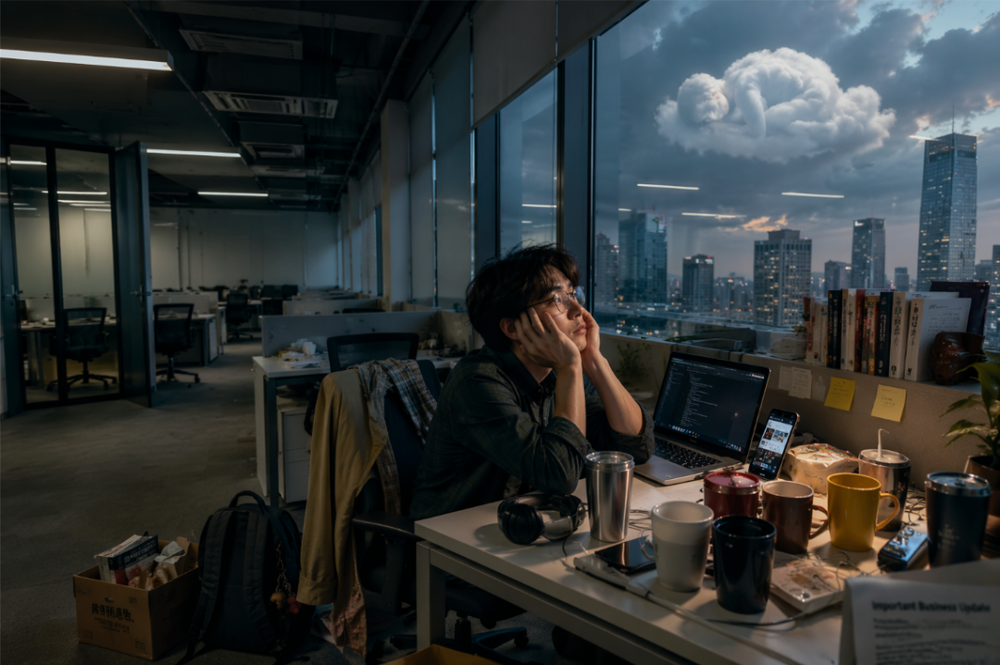
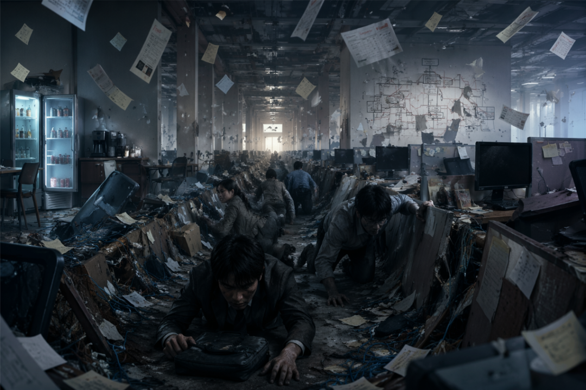
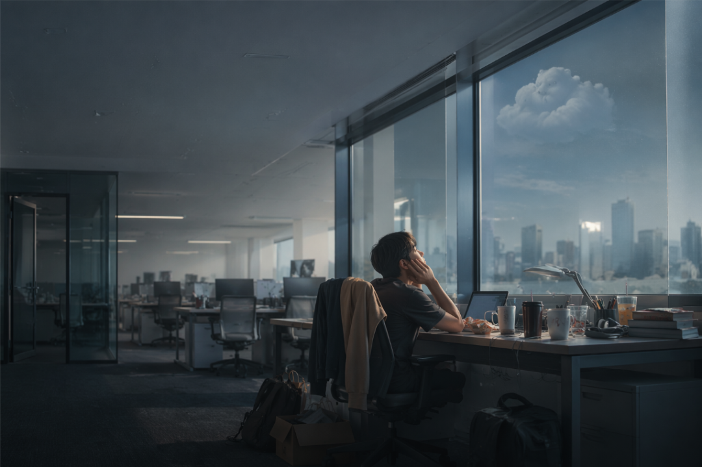

# 我舍不得的不是公司，是我的工位

> 作者: 凡复思忖 | 日期: 2026-07-07

最近脑海中总是浮现两手托腮仰头看天的画面。很小的时候，喜欢火影中的鹿丸，他最喜欢蹲在树荫底下，幻想自己变成一朵云。**可最后，最渴望闲散的人，反而成了最忙碌的人。**

经常会想起吴谢宇。先不说他的行径有多恶劣，单看他背着案底，购买多张身份证，从福州流窜到河南，辗转上海、深圳，最后在重庆又做培训老师，又做男模这件事，就会让人产生一种很复杂的震动。

这当然不是值得赞美的能力。但它让我意识到：有些人即使被剥离出正常社会系统，仍然能找到缝隙继续生存。而如果是我，离开了履历、公司、工位、社保、招聘网站和那一套标准流程，能想到的选择好像只剩下保安、网约车、众包、扫大街、游戏陪玩、考公考编、教培辅导……

最近公司裁员的厉害，眼瞅着最后一口气就要吊不上来了。身在其中的我们，也像是被压迫着，肺部产生夸张的形变，缩到两壁紧贴，吐出最后一口浊气。然后作为最后一批员工，随着亚洲分部，一起埋葬在历史的尘埃中。多年后，如果中美重新度蜜月，经济重新上行，我的工位会有新的人坐进来，不知道他是否会好奇，之前的人在这个工位每天都在做什么。

2026.06，我学会了一个新词，叫做IBU（important business update), 实际上就是裁员的变相说法。当时给的是N+7。这波裁员是微软Azure data的延续。上海紫竹工区是重灾区。管你什么背景什么履历，业务不干了，一视同仁，全部裁掉。

事情远没有结束。

经过一个多月的酝酿，终于在昨天，微软又公开表示，裁员。甚至有身边的小伙伴也收到了。这次的感受比上次更加的冷。比我以前感受过的裁员都冷。

**我不知道该说自己是侥幸没被裁掉，还是说真倒霉没被裁掉。**总之，工作心态发生了巨大的变化。每天来来去去，push AI帮我干活，快速用AI搭起来脚手架，然后在它生成代码的间隙，玩会儿手机。好像说起来，日子也算是变好了。

除了那无休止的组织变化，需要不断接触的新的内容，以及看不到未来的走向，没有其他更不好的了。

**好好的公司怎么就干成了这个样子呢？！！！**

**我最舍不得的是我的工位**，这里很安静，是那种超脱世俗的感觉。**周围没有人吵吵闹闹，我随时随地看视频玩手机，身边有一位博士时不时分享留美见闻，工位上摆满了从茶水间拿过来的零食饮料，**下午三点时一起去吃蛋糕水果，然后在落地窗前畅聊。上下三层楼都是我的休息场所，中午可以去睡饱午觉。

这里是我一切的精神寄托。右边摆满了七种不同风格不同款式的水杯，我想用哪个喝水就用哪个。头上摆了书，脚底下放着箱子，放我的杂物，四五个书包扔在工位上，想用哪个用哪个。椅背上挂着两件我最喜爱的衣服，冷了就穿上。脚底就是新风系统，感觉快不行了还能吸点氧。

我后来才意识到，我舍不得的不是这家公司，而是这个被我一点点筑起来的小型避难所。它像一个临时洞穴，收纳了我这些年所有没有被生活允许安放的东西。

**多好的环境啊。可惜，最近走掉的人越来越多。也许过一个月我也要搬走了。**

许多人都走了，留下了满身伤痕的我们，在战壕中匍匐前进，顶着榴弹和炮火，向着不知道是否正确的目标，拖着伤躯，蠕动。向着那永不到来的黎明。

等待着下一次的裁员，下一次的IBU。

原本的微软，塞满了接受过高等教育的大家。现在，明显感觉到人少了，大家的心态也都随之而变。我每天上班时，通过茶水间冰箱里面剩余的饮料，来判断有多少人今天来上班了。现在，需要判断的是，公司还剩下多少人了。

所幸大家心态都挺好的吧。阮籍猖狂，岂效穷途之哭！

世人都晓神仙好，唯有功名忘不了。古今将相在何方，荒冢一堆草没了。

可我还是会在某个下午，两手托腮，仰头看向窗外。

云还是在那里。

只是我已经很久没有相信，自己真的能变成它了。

---
*原文链接: [查看原文](https://mp.weixin.qq.com/s/urs1Dwht7uua98yvfwiVtQ)*
